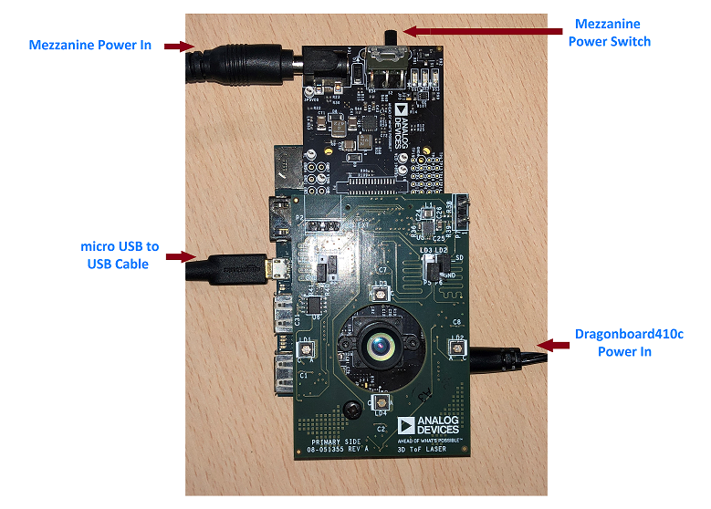
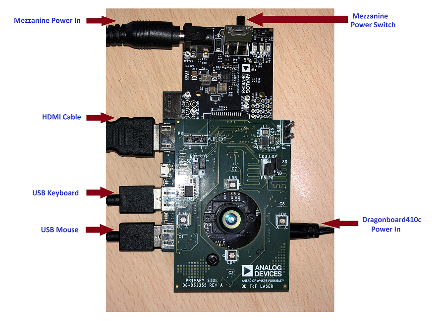

# aditof_sdk
Analog Devices 3D ToF software suite

#### Overview
3D ToF SDK brief overview.
The SDK and Examples can be used in Client-Server mode, where DragonBoard™ 410c acts as a Client, fetching
the image and depth information from TOF sensor and sending it over USB OTG port to the preferred host.
The SDK and Examples can also be used in standalone mode by directly running them on DragonBoard™ 410c.

#### Setting up the DragonBoard™ 410c

If you are setting up the DragonBoard™ 410c for the first time using the prebuilt Kernel and Rootfs image, follow below instructions:\
[*Dragonboard-410c - First time setup*](./doc/dragonboard_first_time.md)

If you want to build and then use Kernel and Rootfs for bringing up DragonBoard™ 410c, follow below instructions:\
[*Dragonboard-410c - Build Kernel and Rootfs*](./doc/dragonboard_firmware_build.md)

#### Environment Setup for Client Server Mode over USB

In Client Server mode, DragonBoard™ 410c needs to be set up with a 'micro USB to USB cable', as below:
<p align="center"><br><br></p>

* To use TOF SDK and Examples in Client Server mode, follow below installation steps on DragonBoard™ 410c.\
1. On DragonBoard™ 410c\
[*Dragonboard-410c - Target*](./doc/dragonboard_target_build.md)

2. On Host\
[*Linux Host - Ubuntu 14.04 and Ubuntu 16.04*](./doc/linux_build.md).
[*MS Windows Host - MS Windows 7 and MS Windows 10*](./doc/windows_build.md).
[*Mac Host - MacOS High-Sierra and MacOS Mojave*]()

* When installation specified in above steps are completed, follow below steps to setup the demo in Client Server mode:
* On DragonBoard™ 410c, go to directory "tof_sdk\apps\uvc-app" and run config_pipe.sh as below:
```
sudo ./config_pipe.sh
```
* On Host:
1. On Linux host, go to directory "tof_sdk\build\examples\aditof-demo\" and run aditof-demo
2. On Windows host, go to directory "tof_sdk\build\examples\aditof-demo\Release\" and run aditof-demo.exe

On Monitor connected to Host PC, you should now be able to see three windows pop up, one for settings control, one showing 'Depth Image' and one showing 'IR Image'.

#### Environment Setup for Standalone Mode
In Standalone mode, DragonBoard™ 410c need to be setup with 'HDMI cable', 'USB Keyboard' and 'USB Mouse', as below:
<p align="center"><br><br></p>

* To use TOF SDK and Examples directly on DragonBoard™ 410c, follow below installation steps.\
[*Dragonboard-410c - Host*](./doc/dragonboard_host_build.md)
* When installation steps specified above are completed, follow below steps to setup the demo in Standalone mode:
* On DragonBoard™ 410c, go to directory "tof_sdk\build\examples\aditof-demo\" and execute below steps:
```
sudo ./config_pipe.sh
sudo ./aditof-demo
```
On HDMI Monitor connected to DragonBoard™ 410c, you should now be able to see three windows pop up,  one for settings control, one showing 'Depth Image' and one showing 'IR Image'.

#### API doxygen documentation
https://analogdevicesinc.github.io/aditof_sdk/

#### Directory Structure
| Directory | Description |
| --------- | ----------- |
| apps | Contains the source code of application to be built and executed on target |
| doc | Contains the documentation |
| examples | Contains the source code of examples to be built and executed on Hosts |
| sdk | Contains the source code of software development kit used by examples |
| References | Contains the prebuilt SDK internal libraries and open source libraries like OpenCV |
| IO_Library | TBD: Contains the host specific code for USB interactions |
| ADI_TOF_UTIL | TBD: Contains the source code of sdk internal libraries |
