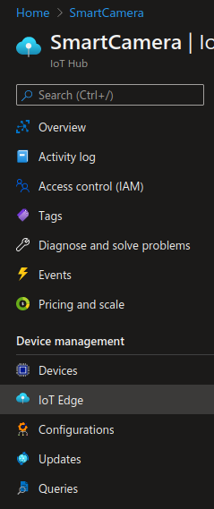
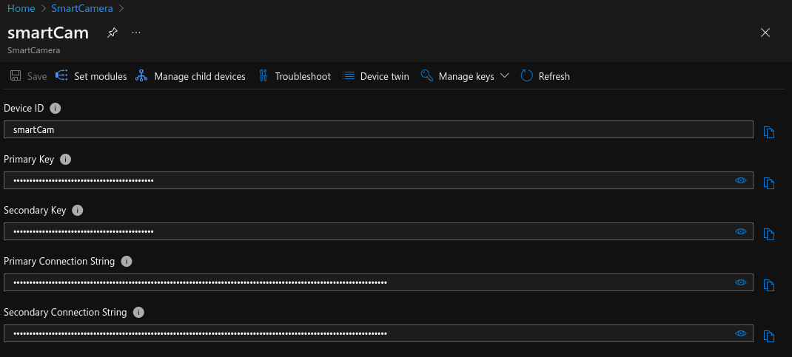
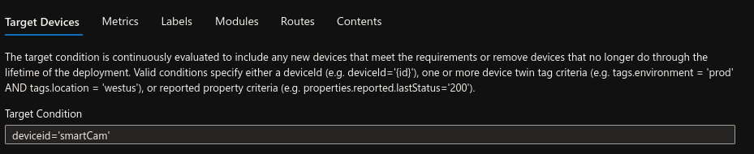

# Azure Iot Edge configuration and deployment on Smart Camera
This section describes how to cofigure the Smart Camera in order to have acces to Azure IoT Hub. By obtaining this connection the user is allowed to develop custom container images to process images and process them on the edge device (Smart Camera) that uses a Jetson Nano SOM. 

## Stepps to configure the camera: 

## 1. Configuring Azure IoT Hub edge Device
After obtaining an Azure IoT portal account the user has to create a custom Research Group and IoT Hub in order to deploy. 
<p align="center">
</br>
</p>

At "IoT Edge" section of the manu add a new device. This generates a virtual device on the iothub with a custom key. With this "Primary Key" you can link the device to the camera:
<p align="center">
</br></p>


## 2. Install IoT Edge on <b>Smart Camera</b>
Run the following code snippet on the camera:
```console
curl -L https://github.com/Azure/azure-iotedge/releases/download/1.0.8-rc1/libiothsm-std_1.0.8.rc1-1_arm64.deb -o libiothsm-std.deb && sudo dpkg -i ./libiothsm-std.deb

curl -L https://github.com/Azure/azure-iotedge/releases/download/1.0.8-rc1/iotedge_1.0.8.rc1-1_arm64.deb -o iotedge.deb && sudo dpkg -i ./iotedge.deb

apt-get fix && sudo apt-get install -f
```
After installationn the following text should appear on the screen:
```console
===============================================================================

                              Azure IoT Edge

  IMPORTANT: Please update the configuration file located at:

    /etc/iotedge/config.yaml

  with your device's provisioning information. You will need to restart the
  'iotedge' service for these changes to take effect.

  To restart the 'iotedge' service, use:

    'systemctl restart iotedge'

    - OR -

    /etc/init.d/iotedge restart

  These commands may need to be run with sudo depending on your environment.

===============================================================================
```

As it is mention in the console the user must modify the /etc/iotedge/config.yamlfile in order to link the device to the previously created virtual device. Use the following command:

```console
sudo vim /etc/iotedge/config.yaml
```
 Find the lines with "#Manual provisioning configuration" and modify the value of the <b>device_connection_string</b> ot the primary key of the virtual device. And save the modifications with ```:wq!``` </br>
 The Smart Camera now is linked to the virtual edgeDevice on the IoT Hub.

 ## 3. Creating and deploying custom json deployment
From the <b>IoT Hub > IoT Edge > IoT Edge Deployment</b> section of the Azure portal select the <b>Add Deployment</b> part and create you own deployment json file for the camera, with the help of 3 auxiliary modules:

| Module                    | Purpose                                                                                                                         | Backing Azure Service                                                    |
|---------------------------|---------------------------------------------------------------------------------------------------------------------------------|--------------------------------------------------------------------------|
| edgeAgent                 | System module that is responsible for connections with the IoT Hub and launching the deployment json                              | [Azure IoT Hub](https://docs.microsoft.com/en-us/azure/iot-hub/?WT.mc_id=julyot-iva-pdecarlo) (Authorization and for obtaining deployment configuration) |
| edgeHub                   | System Module responsible for inter-module communication and message back to Azure IoT Hub                                       | [Azure IoT Hub](https://docs.microsoft.com/en-us/azure/iot-hub/?WT.mc_id=julyot-iva-pdecarlo) (Ingestion of Device to Cloud Telemetry)                   |
| Smart Camera module       | To be completed               | Routing must be specified here                                                                     |

After adding all the neccessary modules the target device must be completed with the device id (deviceid='edgeDevice name'), to link the Smart Camera to this deployment. You can do it from the setting of the deployment from the following part:

<p align="center">
</br></p>