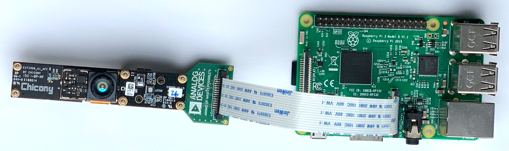

# Raspberry Pi User guide for Chicony ToF camera

## Setting up the system

### Required hardware
- [Chicony ToF module](https://www.chicony.com.tw/chicony/jp/product/ToF)
- The Analog Devices RPI to Chicony ToF interposer
- 5V power supply (micro USB cable) to power up the Chicony ToF
- [Raspberry Pi](https://www.raspberrypi.org/products/) The system was tested on Raspberry Pi3 Model B V1.2 and Raspberry Pi 4. It can work on other models that have a CSI camera interface input.
- Raspberry Pi 5V power supply
- To run the system in standalone mode you'll need an additional HDMI cable to connect to a monitor and a USB keyboard and mouse
- [RPi camera cable](https://www.adafruit.com/product/2087) for connection between RPi and Chicony ToF

### Power on sequence
- plug the SD card into the Raspberry Pi SD card slot. To benefit from the most recent software updates it is highly recommended to update the SD card with the [latest SD card image](https://github.com/analogdevicesinc/aditof_sdk#supported-embedded-platforms)
- connect the HDMI cable from the monitor to the Raspberry Pi HDMI connector
- connect the RPi camera cable between the RPi and the P1 connector of interposer
- connect a USB mouse and keyboard to the Raspberry Pi. It's possible to use either a mouse & keyboard combo or a separate mouse and keyboard
 
 

- connect the 5V power supply (micro USB cable) to the interposer
- connect the 5V power supply to the Raspberry Pi. Once power is connected to the Raspberry Pi the system will boot the Linux OS from the SD card.


### Power off sequence
- under Linux open a terminal and type ***sudo poweroff***. This will safely power off the Raspberry Pi and ensure that the SD card is properly unmounted
- remove the 5V supply from the Raspberry Pi
- remove the 5V supply (micro USB cable) from the interposer

### Troubleshooting
- Linux does not boot
  - The SD card is corrupted and this prevents the system from booting. Reflash the SD card with the SD card image.

## Running the evaluation application

Once Linux boots you'll see on the HDMI monitor the Linux desktop and on the top left corner a shortcut to the evaluation application. Double clicking on the icon will start the evaluation application.  A console window will open to show the application's status and, after a few seconds, the evaluation application GUI will be displayed.


The evaluation application allows to do live streaming of depth and IR data as well as recording the depth and IR data and playing back from a file. The depth data is displayed as a color map ranging from warm to cold colors as the distance from the camera increases. A point in the middle of the depth image shows the distance in mm to the target.

The framerate at which data is acquired from the system is constantly updated on the GUI. The camera board outputs data at 30 frames per second (fps), but due to system load the evaluation application processes the frames at a lower rate.

### Note
 - Use the custom X button which is under the title bar on the top-right side to close the application. Otherwise the application will hang.

### Troubleshooting
- The demo application hangs after closing the main window
  - Due to some limitations the application always hangs if it is closed using the regular X button from the window top bar (title bar). To avoid this unpleasant hang, we've made available a second X button in the top right corner right above the title bar that can be used to safely close the demo application. We hope this to be a temporary workaround.

## Building the SDK

### SDK dependencies
The SDK, the included applications and the example code depend on the following:
 - v4l-utils
 - cmake
 - python 3
 - opencv v3.4.1
 - glog v0.3.5
 - libwebsockets v3.1
 - protocol buffers v3.9.0
 - chicony_firmware.bin

The SD card image already contains all the SDK dependencies and there's no need to install them again. To update and build the SDK just follow the steps below.

```console

pi@raspberry:~/workspace/github/aditof_sdk$ git pull
pi@raspberry:~/workspace/github/aditof_sdk$ cd build
pi@raspberry:~/workspace/github/aditof_sdk/build$ cmake -DRASPBERRYPI=1 ..
pi@raspberry:~/workspace/github/aditof_sdk/build$ make -j4
```

### Note
 - chicony_firmware.bin needs to be copied from aditof_sdk/misc to aditof_sdk/
 ```console

pi@raspberry:~/workspace/github/aditof_sdk$ cp misc/chicony_firmware.bin .
```

## Linux Kernel
A customized [kernel](https://github.com/analogdevicesinc/linux/tree/adi-4.19.0) is provided for the Raspberry Pi including the [V4L2 driver for the ADDI9036](https://github.com/analogdevicesinc/linux/blob/adi-4.19.0/drivers/media/i2c/addi9036.c) and other improvements to support all the ADI depth camera features.
